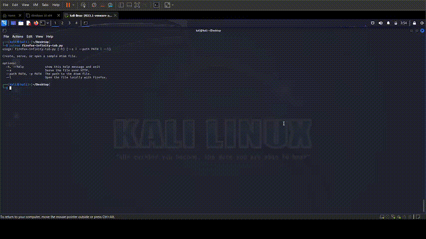

# Firefox Infinity Tab




A issue has been identified where a combination of a bug in Mozilla Firefox and a misconfiguration in the xdg-mime default applications settings can trigger an infinite loop of tab openings in Firefox. This behavior can render the browser unusable and may lead to system instability due to excessive resource consumption.

## Features

- Create a sample Atom feed file with predefined content.
- Serve the Atom feed file over HTTP using a simple server.
- Open the Atom feed file locally in Firefox.

## Installation

Before running the script, ensure you have Python installed on your system. This script was written using Python 3 and has not been tested with Python 2.

1. Clone the repository or download the script to your local machine.
2. Make sure you have Firefox installed and it's accessible from the command line.

## Usage

The script accepts command-line arguments to perform its functions. Here are the options you can use:

- `--s`: Serve the file over HTTP.
- `--path`, `-p`: Specify the path to the Atom file. Defaults to `firefox_infinity_tab.atom`.
- `--l`: Open the file locally with Firefox.

### Creating and Opening a File Locally

To create a sample Atom feed file and open it with Firefox, run:

```
python script.py --l
```

Serving the File Over HTTP
To serve the Atom feed file over HTTP, run:


```
python script.py --s
```

The server will start on port 8000, and you can access the feed at http://localhost:8000/firefox_infinity_tab.atom.


### Background 

The issue arises when a specific MIME type is incorrectly associated with Firefox itself. When a file with this MIME type is triggered, Firefox attempts to open it but then delegates the action back to xdg-mime, which, due to the misconfiguration, instructs Firefox to open the file again. This loop continues indefinitely, opening new tabs in rapid succession.

Steps to Reproduce:

Set Firefox as the default application for a MIME type using xdg-mime, e.g., xdg-mime default firefox.desktop application/x-example.
Attempt to open a file with the MIME type application/x-example.
Observe that Firefox opens a new tab to handle the file.
Witness the continuous opening of new tabs in an infinite loop.
Expected Behavior:
Firefox should either correctly display the content associated with the MIME type or prompt the user to choose an appropriate application to handle the file if it cannot process it internally.

Actual Behavior:
Firefox enters an infinite loop of opening new tabs, which can only be stopped by forcefully closing the browser or terminating its process.

Workaround:
To prevent this issue, users should verify their MIME type associations and ensure that Firefox is not set to handle MIME types it cannot process. This can be done by checking the ~/.config/mimeapps.list file or using the xdg-mime query default <MIME-type> command to check the default application for a particular MIME type.

Resolution:
Users affected by this issue should reset their MIME type associations for the affected types using the xdg-mime default command with a correct application or remove the association if it is not needed. Additionally, a bug report should be filed with the Firefox development team so that they can address the issue in a future update.

Preventive Measures:
To prevent such issues in the future, it is recommended that:

The Firefox team implements a check to prevent the browser from being set as a handler for unsupported MIME types.
A safeguard is added to detect and interrupt the process if an infinite loop of tab openings is detected.
Users regularly review and verify their system's MIME type associations, especially after installing or updating applications that interact with file types.
This incident highlights the importance of proper MIME type configuration and the need for robust error handling within applications to prevent system resource exhaustion scenarios.


### Disclaimer
This script is for educational purposes only. Serving files over HTTP will make them accessible to anyone on your network. Be cautious with the content you serve and ensure you have the right to share any data you serve.

